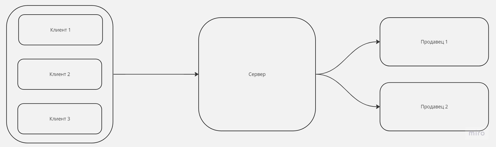
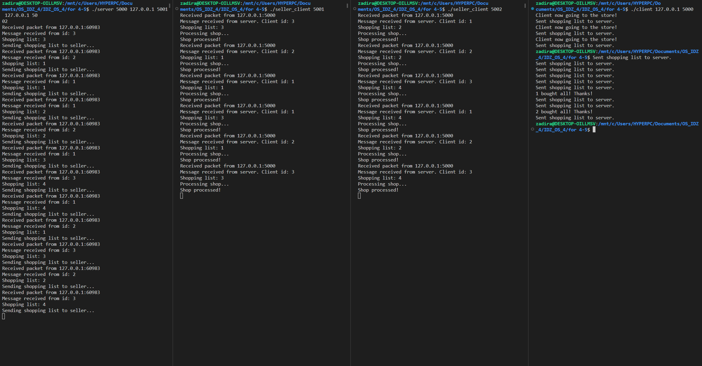
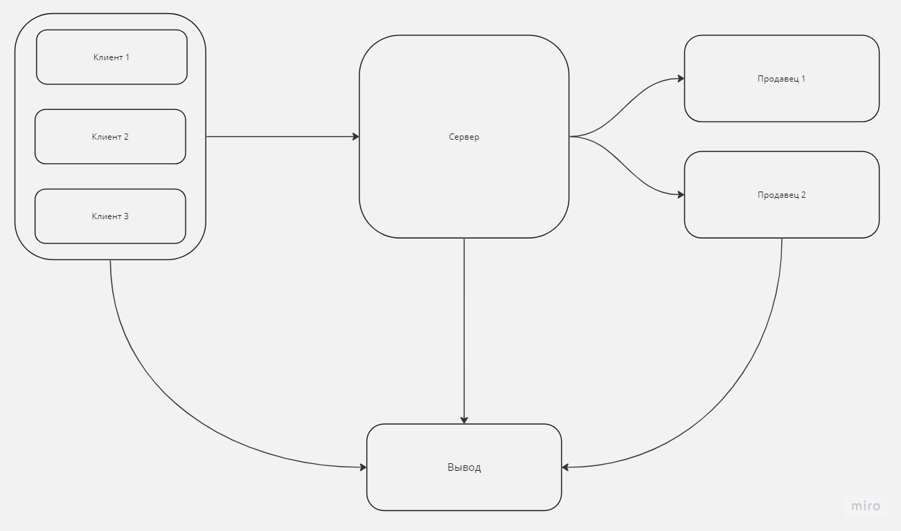
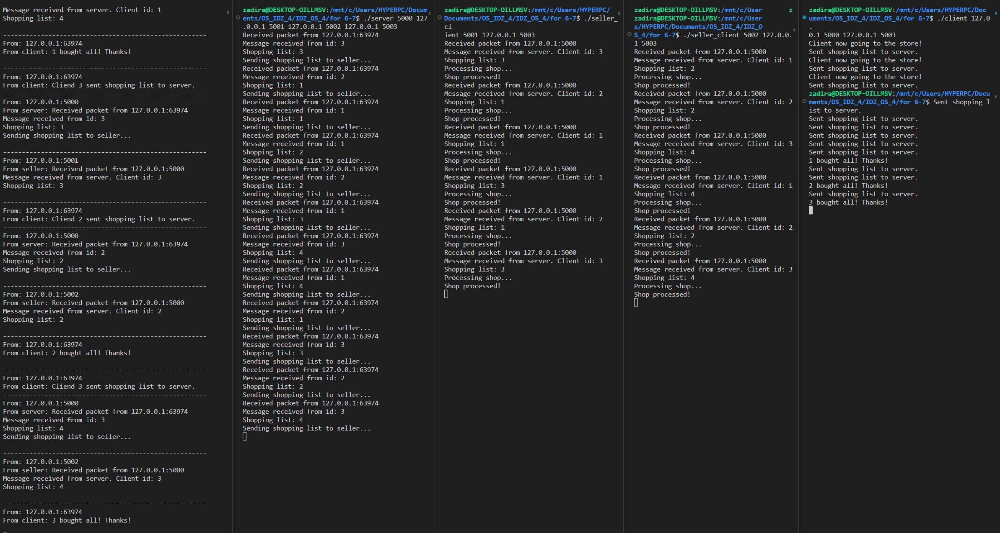

# ИДЗ ОС 4
Выполнил Парахин Николай Викторович, БПИ 212

Условие:

Вариант 20

Задача о магазине – 2 (забывчивые покупатели). В магазине работают два отдела, каждый отдел обладает уникальным ассортиментом. 
В каждом отделе работает один продавец. В магазин ходят исключительно забывчивые покупатели, поэтому каждый покупатель носит с собой список товаров, 
которые желает купить. По купатель приобретает товары точно в том порядке, в каком они записаны в его списке. При этом товары в списке расположены в
случайном порядке, что заставляет покупателя переходить от отдела к отделу, если это требуется для совершения покупок. Продавец
может обслужить только одного покупателя за раз. Покупатель, вставший в очередь, засыпает пока не дойдет до продавца. 
Продавец засыпает, если в его отделе нет покупателей, и просыпается, если появится хотя бы один. Создать приложение, моделирующее работу магазина в течение рабочего дня. Каждый
продавец — клиент. Покупатели изначально порождаются отдельным клиентом. Сервер обеспечивает взаимодействие покупателей и клиентов.

## Программа на 4-5 балла(ов)

Программа, реализованная на [оценку от 4х до 5ти баллов](for%204-5), использует данную схему:


Программа [client.c](for%204-5/client.c) создает процессы клиентов, назначает клиентам
id и корзины с покупками.

Программа [server.c](for%204-5/server.c) распределяет запросы клиентов на продавцов.

Программа [seller_client.c](for%204-5/seller_client.c) принимает запросы от сервера и совершает продажу необходимого товара.

Покупки бывает 4х типов, которые выражаются числами: 1, 2, 3, 4.

Товары 1 и 3 продаются у первого продавца. Товары 2 и 4 продаются у второго продавца.

Сервер, при поступлении запроса от клиента, в зависимости от типа товара распределяет
его на продавцов.

### Результаты тестирования

Ниже приведены результаты тестирования:


В первой колонке слева -- вывод сервера.
Посередине -- вывод двух продавцов.
Справа -- вывод клиентов.

### Запуск

Пример запуска из нескольких терминалов:

```bash
# сервер
./server 5000 127.0.0.1 5001 127.0.0.1 5002
```

```bash
# первый продавец
./seller_client 5001
```

```bash
# второй продавец
./seller_client 5002
```

```bash
# Клиенты
./client 127.0.0.1 5000
```

## На 6-7 баллов
Добавлена новая программа, которая позволяет выводить всю информацию, которая происходит
на разных этапах выполнения программы: [listener.c](for%206-7/listener.c)
Теперь схема выполнения программы такая:

Были изменены программы на прошлый балл, добавлена возможность отслеживать все выводы на другом сервере:

В данном примере самый левый столбец является новым выводом информации. Вот полный вывод:
```bash
------------------------------------------------------
From: 127.0.0.1:63974
From client: Client 3 now going to the store!

------------------------------------------------------
From: 127.0.0.1:63974
From client: Cliend 3 sent shopping list to server.
------------------------------------------------------
From: 127.0.0.1:5000
From server: Received packet from 127.0.0.1:63974
Message received from id: 3
Shopping list: 3
Sending shopping list to seller...

------------------------------------------------------
From: 127.0.0.1:5001
From seller: Received packet from 127.0.0.1:5000
Message received from server. Client id: 3
Shopping list: 3

------------------------------------------------------
From: 127.0.0.1:63974
From client: Client 2 now going to the store!

------------------------------------------------------
From: 127.0.0.1:63974
From client: Cliend 2 sent shopping list to server.
------------------------------------------------------
From: 127.0.0.1:5000
From server: Received packet from 127.0.0.1:63974
Message received from id: 2
Shopping list: 1
Sending shopping list to seller...

------------------------------------------------------
From: 127.0.0.1:63974
From client: Client 1 now going to the store!

------------------------------------------------------
From: 127.0.0.1:63974
From client: Cliend 1 sent shopping list to server.
------------------------------------------------------
From: 127.0.0.1:5000
From server: Received packet from 127.0.0.1:63974
Message received from id: 1
Shopping list: 1
Sending shopping list to seller...

------------------------------------------------------
From: 127.0.0.1:5001
From seller: Received packet from 127.0.0.1:5000
Message received from server. Client id: 2
Shopping list: 1

------------------------------------------------------
From: 127.0.0.1:63974
From client: Cliend 1 sent shopping list to server.
------------------------------------------------------
From: 127.0.0.1:5000
From server: Received packet from 127.0.0.1:63974
Message received from id: 1
Shopping list: 2
Sending shopping list to seller...

------------------------------------------------------
From: 127.0.0.1:5002
From seller: Received packet from 127.0.0.1:5000
Message received from server. Client id: 1
Shopping list: 2

------------------------------------------------------
From: 127.0.0.1:5001
From seller: Received packet from 127.0.0.1:5000
Message received from server. Client id: 1
Shopping list: 1

------------------------------------------------------
From: 127.0.0.1:63974
From client: Cliend 2 sent shopping list to server.
------------------------------------------------------
From: 127.0.0.1:5000
From server: Received packet from 127.0.0.1:63974
Message received from id: 2
Shopping list: 2
Sending shopping list to seller...

------------------------------------------------------
From: 127.0.0.1:63974
From client: Cliend 1 sent shopping list to server.
------------------------------------------------------
From: 127.0.0.1:5000
From server: Received packet from 127.0.0.1:63974
Message received from id: 1
Shopping list: 3
Sending shopping list to seller...

------------------------------------------------------
From: 127.0.0.1:5002
From seller: Received packet from 127.0.0.1:5000
Message received from server. Client id: 2
Shopping list: 2

------------------------------------------------------
From: 127.0.0.1:63974
From client: Cliend 3 sent shopping list to server.
------------------------------------------------------
From: 127.0.0.1:5000
From server: Received packet from 127.0.0.1:63974
Message received from id: 3
Shopping list: 4
Sending shopping list to seller...

------------------------------------------------------
From: 127.0.0.1:5001
From seller: Received packet from 127.0.0.1:5000
Message received from server. Client id: 1
Shopping list: 3

------------------------------------------------------
From: 127.0.0.1:5002
From seller: Received packet from 127.0.0.1:5000
Message received from server. Client id: 3
Shopping list: 4

------------------------------------------------------
From: 127.0.0.1:63974
From client: Cliend 1 sent shopping list to server.
------------------------------------------------------
From: 127.0.0.1:5000
From server: Received packet from 127.0.0.1:63974
Message received from id: 1
Shopping list: 4
Sending shopping list to seller...

------------------------------------------------------
From: 127.0.0.1:63974
From client: Cliend 2 sent shopping list to server.
------------------------------------------------------
From: 127.0.0.1:5000
From server: Received packet from 127.0.0.1:63974
Message received from id: 2
Shopping list: 1
Sending shopping list to seller...

------------------------------------------------------
From: 127.0.0.1:5001
From seller: Received packet from 127.0.0.1:5000
Message received from server. Client id: 2
Shopping list: 1

------------------------------------------------------
From: 127.0.0.1:5002
From seller: Received packet from 127.0.0.1:5000
Message received from server. Client id: 1
Shopping list: 4

------------------------------------------------------
From: 127.0.0.1:63974
From client: 1 bought all! Thanks!

------------------------------------------------------
From: 127.0.0.1:63974
From client: Cliend 3 sent shopping list to server.
------------------------------------------------------
From: 127.0.0.1:5000
From server: Received packet from 127.0.0.1:63974
Message received from id: 3
Shopping list: 3
Sending shopping list to seller...

------------------------------------------------------
From: 127.0.0.1:5001
From seller: Received packet from 127.0.0.1:5000
Message received from server. Client id: 3
Shopping list: 3

------------------------------------------------------
From: 127.0.0.1:63974
From client: Cliend 2 sent shopping list to server.
------------------------------------------------------
From: 127.0.0.1:5000
From server: Received packet from 127.0.0.1:63974
Message received from id: 2
Shopping list: 2
Sending shopping list to seller...

------------------------------------------------------
From: 127.0.0.1:5002
From seller: Received packet from 127.0.0.1:5000
Message received from server. Client id: 2
Shopping list: 2

------------------------------------------------------
From: 127.0.0.1:63974
From client: 2 bought all! Thanks!

------------------------------------------------------
From: 127.0.0.1:63974
From client: Cliend 3 sent shopping list to server.
------------------------------------------------------
From: 127.0.0.1:5000
From server: Received packet from 127.0.0.1:63974
Message received from id: 3
Shopping list: 4
Sending shopping list to seller...

------------------------------------------------------
From: 127.0.0.1:5002
From seller: Received packet from 127.0.0.1:5000
Message received from server. Client id: 3
Shopping list: 4

------------------------------------------------------
From: 127.0.0.1:63974
From client: 3 bought all! Thanks!
```
### Запуск
Теперь, чтобы запустить программы, необходимо исопользовать следующие комманды в разных терминалах:

```bash
# сервер общего вывода
./listener 5003
```

```bash
# сервер
./server 5000 127.0.0.1 5001 127.0.0.1 5002 127.0.0.1 5003
```

```bash
# первый продавец
./seller_client 5001 127.0.0.1 5003
```

```bash
# второй продавец
./seller_client 5002 127.0.0.1 5003
```

```bash
# Клиенты
./client 127.0.0.1 5000 127.0.0.1 5003
```

Последние данные задают ip и порт сервера для общего вывода.